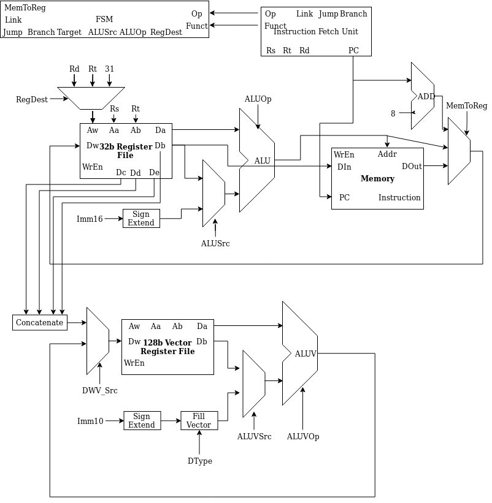

Lab 4
===============
*Maximilian Schommer & Solomon Greenberg*

The goal of this lab is to extend our CPU from Lab 3 with a set of SIMD (Single Instruction Multiple Data) instructions. We will be very loosely following the [MIPS SIMD whitepaper](https://s3-eu-west-1.amazonaws.com/downloads-mips/documents/MD00926-2B-MSA-WHT-01.03.pdf). 

## SIMD Architecture ##

SIMD adds a new type of instruction, a vector instruction, which operates on a special set of registers. These registers are 128 bits wide, and there are 32 of them. There exists a possibility of using Virtual Processing Elements (VPEs) in which fewer than 32 registers can be implemented, but for the sake of simplicity we will ignore these, and simply build all 32. There is another option to have the 128 bits share 64 bits of an Floating Point Unit, which we will also not implement for simplicity. Vector operations operate on the vector registers, but with the additional constraint of a data-type indication which indicates how the 128 bits should be partitioned. There are 5 types of partitions. 

| Data Format        | Abbreviation  |   Op-Code Value  |
| :----------------: |:-------------:|:----------------:|
| Byte, 8-bit        | b             | 0                |
| Halfword, 16-bit   | h             | 1                |
| Word, 32-bit       | w             | 2                |
| Doubleword, 64-bit | d             | 3                |
| Vector, 32-bit     | v             | 4                |

Vector operations are coded to operate on the 128 bit register with these distinctions in mind. For example, ADDVI can be coded as ADDVI.B, ADDVI.H, ADDVI.W, ADDVI.D, or ADDVI.V to add an immediate to the various sizes of argument. Vecotr operations can operate between vector registers as well. `addv.w   $w5,$w1,$w2` for instance, adds each word in `$w1` to each word in `$w2` and places the result in `$w5`. ADDVI.df represents the ADDVI operation for all supported data formats. For simplicity, we will be implementing load and store operations that act on Words only, and arithmetic operations that work on all data types. Operations exist to load general purpose registers (GPR) to the vector registers in various ways. `fill.w   $w6,$2` loads the 32 bit GPR `$2` into each word in `w6`. All vector registers are temporary, in that they need to be callee-saved by convention. 

The vector instructions will be coded by the 4 MSB's as equal to `0111` which is unused in MIPS. The vector op-code will be given by the next 8 bits `[27:20]`. We will be deviating from the MIPS SIMD for our specific implementation, choosing a set of useful vector operations to implement.

NOTE: For operations that work on multiple data formats, their vector op-code is given by the base op code plus the Op-Code Value given in the table above. 

LDV.W: Load Vector from four adjacent GPRs as words.

 - Format: `$d = {$s, $s+1, $s+2, $s+3}`     
 - `011100 ddddd sssss 00000 0000000010`    
 - `$d` is the destination Vector register     
 - `$s` is the start source register, where `$s`, `$s+1`, `$s+2`, `$s+3` are all
   loaded.
   
STV.W: Store Vector into a group of four GPRs.  

 - Format: `$d, $d+1, $d+2, $d+3 = $s`
 - `011100 ddddd sssss 00000 0000000111`
 - `$d` is the destination start GPR, where `$d`, `$d+1`, `$d+2`, `$d+3` are all stored.
 - `$s` is the source Vector register
  
ADDV.df: Add two Vectors togeather, according to data type.

 - Format: `$d = $a + $b`
 - `000111 ddddd aaaaa bbbbb 00000 001010[+ Op-Code Value]`
 - `$d` is the destination Vector register
 - `$a` is the first source Vector register
 - `$b` is the second source Vector register

SUBV.df: Subtract two vectors, word-wise.

 - Format: `$d = $a - $b`
 - `000111 ddddd aaaaa bbbbb 00000 001111[+ Op-Code Value]`
 - `$d` is the destination Vector register
 - `$a` is the first source Vector register
 - `$b` is the second source Vector register

ADDIV.df: Add an immediate to a vector.

 - Format: `$d = $s + imm`
 - `000111 ddddd sssss iiiiiiiiii 010100[+ Op-Code Value]`
 - `$d` is the destination Vector register
 - `$s` is the source Vector register
 - `i` is the immediate value

XORV: Bitwise XOR on two vectors.

 - Format: `$d = $a | $b`
 - `000111 ddddd aaaaa bbbbb 00000 011001`
 - `$d` is the destination Vector register
 - `$a` is the first source Vector register
 - `$b` is the second source Vector register

ANDV: Bitwise AND on two vectors.

 - Format: `$d = $a & $b`
 - `000111 ddddd aaaaa bbbbb 00000 011010`
 - `$d` is the destination Vector register
 - `$a` is the first source Vector register
 - `$b` is the second source Vector register

## Design ##

We started out with the CPU we had written for Lab 3. Then, we added another set of 128 bit registers, able to do 128-bit reads and writes. The wide registers were wired to a vectorized ALU, able to perform arithmatic on two vectors up to 128 bits each in total size. Each vector is able to consist of either sixteen bytes (8b), eight half words (16b), four words (32b), two double words (64b), or a 128-bit integer. Results are stored back in the 128b register file. Vectors in the vector register are able to be simultaniously bulk loaded into four addresses in the main register file of the CPU. 

Additional FSM modifications were needed, with the new instructions being integrated as V-type instructions, with a format similar to R-type.

## Testing Process ##
We kept the testing process generally isolated to the new vectorized features, sans some regression testing to make sure we weren't breaking any of the existing CPU. To run all individual test cases, from the root directory run run_tests.sh. In order to test the cpu, run run_cpu.sh. Place a text binary file named progmem.mem for the cpu to read. When the cpu is run, it will print out the final register states. To verify that the program ran successfully, compare the registers to the registers when a program is run from a MIPS emulator. 

## Block Diagram ##

## Performance ##

The primary bottleneck to our vectorized unit's speed is removing data from the vector registers. We attempted to allow for both bulk writes to and reads from the vector registers, but weren't able to get the bulk read operational. As such, to load in a 128-bit vector, it will take at one clock cycle to move the data to the vector register, but to move data from the vector registers to the general purpose registers will take four clock cycles. 

The area used is also extremely large - we added a second, much larger (128-bit) ALU and a second set of registers just for the vectorized unit. A better course of action would've been to use a single ALU for both ordinary and vector arithmatic, as well as a single register file, but we ran out of time.
